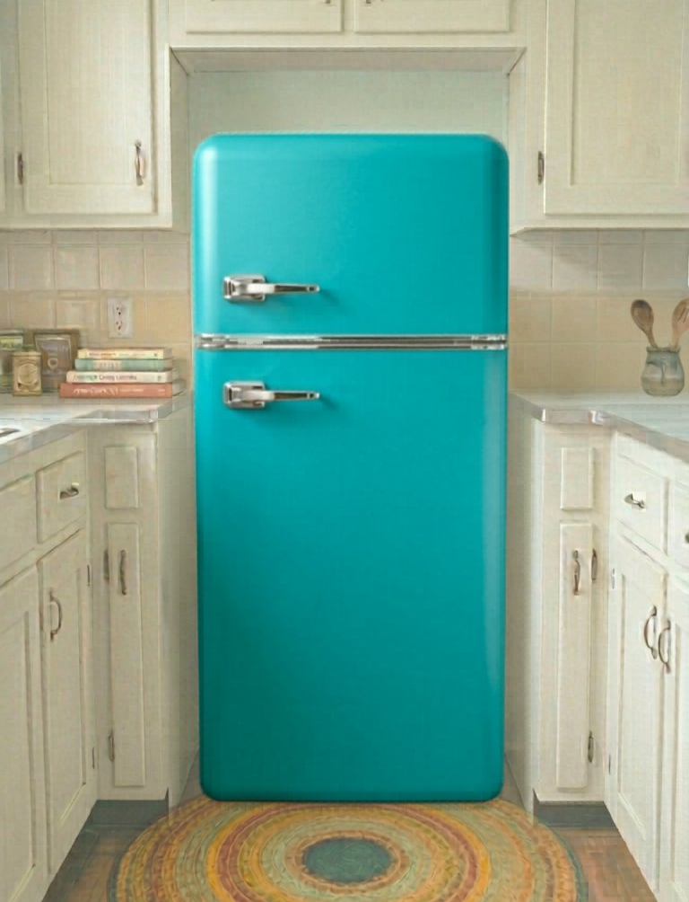

<p align="center">
  
</p>

# 🏠 HomeBakes

> *A retro kitchen-inspired recipe management web app built with Flask and Firebase.*

HomeBakes is a full-stack web application that brings the warmth of a vintage kitchen to recipe management. Users can store, organize, and browse their family recipes in a beautifully designed digital recipe box — complete with a personalized kitchen dashboard, picture frame, and fridge magnets.

---

## 📸 Screenshots

### Kitchen Dashboard


---

## ✨ Features

- **Personalized Kitchen Dashboard** — A retro teal refrigerator scene with your name in the nav, a clickable picture frame for your photo, and fridge magnets linking to your meal planner and shopping lists
- **Recipe Box** — Create, view, edit, and delete recipes with ingredients, directions, and notes
- **Recipe Card Design** — Beautiful teal recipe cards with paper texture, a CSS folder tab, and three font styles (Typewriter, Grandma's Hand, Modern)
- **Ingredient Typeahead** — Search from a database of 360+ categorized ingredients with unit selection
- **Recipe Photo Upload** — Upload a photo of your dish, stored in Firebase Storage
- **Recipe Listing** — Browse your recipes with search and category filters on a custom FlowerPetal Formica background
- **Secure Auth** — Email/password authentication with ownership-based edit/delete protection
- **Universal Nav** — Consistent navigation across all pages with an oversized circular icon

---

## 🛠️ Tech Stack

| Layer | Technology |
|---|---|
| Backend | Python / Flask |
| Frontend | HTML, CSS, JavaScript (no framework) |
| Database | Google Firestore (NoSQL) |
| Auth | Firebase Authentication |
| Storage | Firebase Storage |
| Hosting | Render (free tier) |
| Deployment | GitHub → GitHub Actions → Render auto-deploy |

---

## 🎨 Design System

HomeBakes uses a retro 1950s kitchen aesthetic throughout:

- **Colors:** Teal (`#98D0D6`), dark teal (`#35595F`), warm cream (`#FAF7F0`)
- **Fonts:** Playfair Display, Lato, Special Elite, Caveat, DM Sans, Satisfy
- **Backgrounds:**
  - Home: Yellow subway tile + kitchen scene composite image
  - Recipes: *FlowerPetal Formica* — a custom pure-CSS boomerang petal pattern
  - Recipe Form/View: CSS cream gingham

---

## 📁 Project Structure

```
home-bakes/
├── app.py                    ← Flask entry point
├── requirements.txt
├── render.yaml               ← Render deployment config
├── routes/
│   ├── auth.py               ← Auth decorator
│   ├── recipes.py            ← Recipe CRUD
│   ├── meal_plans.py
│   ├── shopping_lists.py
│   ├── ingredients.py
│   └── units.py
├── templates/
│   ├── index.html            ← Kitchen dashboard
│   ├── recipes.html          ← Recipe listing
│   ├── recipe-form.html      ← Create/edit recipe
│   ├── recipe-view.html      ← View single recipe
│   ├── meal-plans.html
│   ├── shopping-lists.html
│   ├── login.html
│   └── register.html
└── static/
    ├── css/                  ← Page-specific stylesheets
    ├── js/                   ← Firebase, auth, API, nav
    └── images/               ← Kitchen scene, icons, magnets
```

---

## 🗄️ Data Model

### Firestore Collections

**ingredients/** — 360+ pre-seeded ingredients across 19 categories

**units/** — 27+ units (tsp, Tbsp, cup, oz, lb, g, ea, etc.)

**users/**
```
{uid}: displayName, email, framePhotoURL, frameCaption, createdAt
```

**recipes/**
```
{id}: uid, title, meal_type, recipe_category, isPublic, imageUrl, createdAt
  └── recipe_ingredients/: order, ingredientName, amount, unitName, note
  └── directions/: order, title, text
```

---

## 🚀 Getting Started

### Prerequisites
- Python 3.10+
- Firebase project with Firestore, Auth, and Storage enabled
- A `firebase_admin_key.json` service account key

### Local Setup

```bash
# Clone the repo
git clone https://github.com/aimeewirick/home-bakes.git
cd home-bakes

# Install dependencies
pip install -r requirements.txt

# Set up environment variable (local)
export FIREBASE_CREDENTIALS=$(cat firebase_admin_key.json)

# Seed the ingredient database (run once)
python populate_ingredients.py
python populate_units.py

# Run locally
python app.py
```

Visit `http://localhost:5000`

### Deployment (Render)

1. Push to `main` branch on GitHub
2. GitHub Actions triggers automatically
3. Render builds and deploys from `render.yaml`
4. Set `FIREBASE_CREDENTIALS` as an environment variable in Render dashboard

---

## 🔒 Security

- All recipe edit/delete routes verify `uid === g.uid` server-side
- Firebase Storage rules restrict frame photo uploads to the authenticated user
- Recipe images are publicly readable but only writable by the recipe owner
- Frontend also hides edit/delete buttons from non-owners

---

## 📅 Development Timeline

This project is being built over a 10-week class term:

| Week | Focus |
|---|---|
| 1 ✅ | Project setup, Firebase, auth, home dashboard |
| 2 ✅ | Recipe form, recipe view, ingredient typeahead, image upload |
| 3 ✅ | Recipe listing, universal nav, FlowerPetal Formica, kitchen scene |
| 4 🔄 | Admin ingredients page, meal planner foundation |
| 5 | Meal planner — adding meals |
| 6 | Shopping list generation |
| 7 | Shopping lists page |
| 8 | Mobile responsive, color themes |
| 9 | PDF export, shareable links |
| 10 | Testing, bug fixes, final polish |

---

## 🌐 Live Demo

**[https://home-bakes-404h.onrender.com](https://home-bakes-404h.onrender.com)**

> Note: The app is hosted on Render's free tier and may take 30-60 seconds to wake up after inactivity.

---

## 👩‍🍳 Author

**Aimee Wirick**
Oregon State University — CS361 Web Development
GitHub: [@aimeewirick](https://github.com/aimeewirick)

---

*Built with 💙 and a love of retro kitchens*
